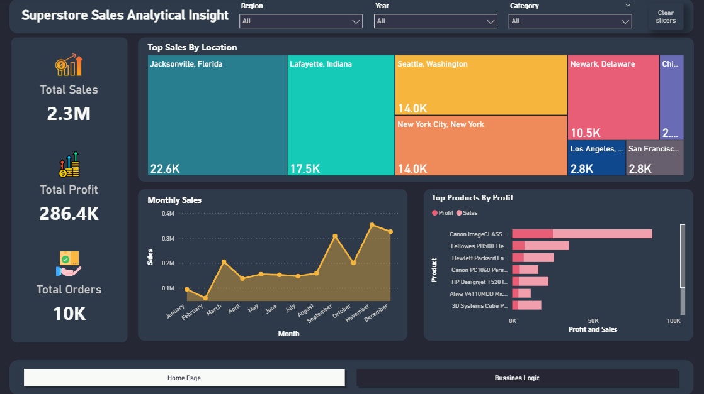
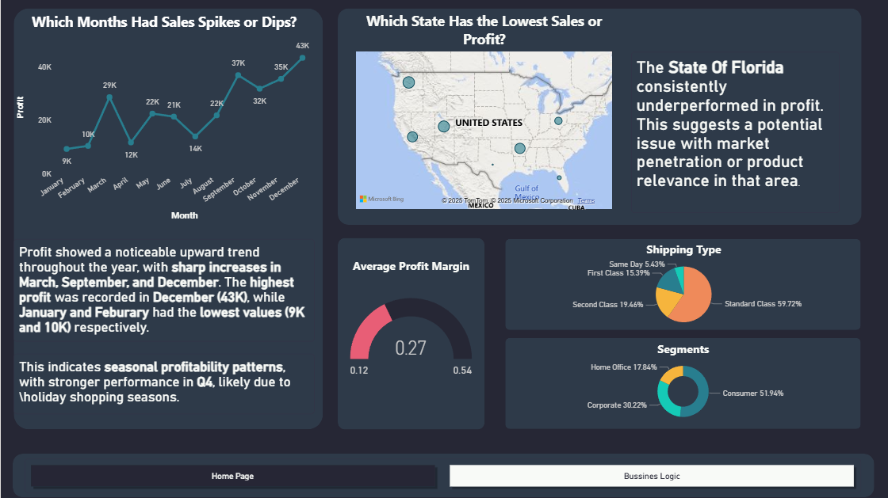

# 📊 Superstore Sales Analysis Project

## 🧠 Project Overview
This project simulates the responsibilities of a data analyst working with real-world business data.
I used a global retail dataset to perform end-to-end analysis of sales and profit trends, built interactive dashboards in Power BI, and provided actionable insights across time, location, products, and customer segments.

## 🎯 Objectives
Analyze monthly profit and sales trends to identify seasonal patterns.

Track regional and state performance to detect underperforming areas.

Identify top-selling and most profitable products.

Evaluate shipping types, customer segments, and profit margins.

Simulate the analytical thinking required for data-driven decision-making.

## 🗃 Dataset Used
Source: [Kaggle – Superstore Dataset](https://www.kaggle.com/datasets/vivek468/superstore-dataset-final?resource=download)

Contains ~10K orders across U.S. states with features like:

- Order Date, Sales, Profit, Region, State

- Product Category, Discount, Segment, Shipping Type

## 🛠️ Tools Used
1. Power BI: Data visualization & interactive dashboard creation
2. Excel: Data cleaning and preliminary pivot analysis
3. DAX:	Custom calculations like profit margin
4. Git & GitHub	Version control and project publishing

## ⚙️ Power BI Features & Technologies Used
- Data Import	Imported data from Excel and cleaned it inside Power BI
- Power Query Editor	Adjusted column types and filtered data before loading
- Data Model	Built relationships between tables (if needed)
- DAX Measures	Created calculated columns for Profit Margin, Cost, and KPIs
- Slicers	Enabled filtering by Region, Segment, Category, and more
- Custom Visuals	Line charts, bar charts, tree maps, cards, and maps to show trends and performance
- Smart Narrative (optional)	Automatically summarized key insights on dashboard pages
- Page Navigation	Created multiple pages (Home, Business Logic, Insights) for clarity and organization
- Tooltips	Added detailed hover information to key visuals

## 📈 Dashboard Features

🔹 Home Page
- Total Sales, Profit, and Orders KPIs

- Tree Map of Top-Selling Cities

- Line Chart of Monthly Sales Trends

- Bar Chart of Top Products by Profit

🔹 Business Logic Page
- Line Chart showing Monthly Profit Variations

- Highlight card: Average Profit Margin

- Map of States with Lowest Profit

- Pie Charts for Shipping Methods and Customer Segments

- Insight panels with findings and suggested actions

## 🔍 Key Insights
🟡 Monthly Performance
- Sharp profit spikes in March, September, and December, with dips in January and February.

- Indicates seasonal profitability patterns, likely influenced by holiday or promotional cycles.

🟡 Regional Performance
- Florida consistently underperformed in terms of profit.

- Suggests possible issues in market penetration or product relevance.

🟡 Product Profitability
- Canon imageCLASS products led in profit, followed by Fellowes and HP models.

- A small group of products contributes disproportionately to total profit (Pareto principle).

🟡 Customer Segments & Shipping
- Most customers are in the Consumer segment (52%) and prefer Standard Class shipping (60%).

- Fast delivery options are underutilized, potentially indicating pricing sensitivity.

## 💡 Recommendations (Framed as a Data Analyst)
- Investigatating Q1 performance drops to smooth annual revenue trends.

- Considering promotional efforts in Florida or reassess inventory strategies there.

- Focusing inventory/marketing on top-performing products to maximize returns.

- Exploroing ways to optimize shipping options for faster delivery without margin loss.

**You can access the PowerBI and Excel files from [here](data)**

**Some Insights were made by ChatGPT**